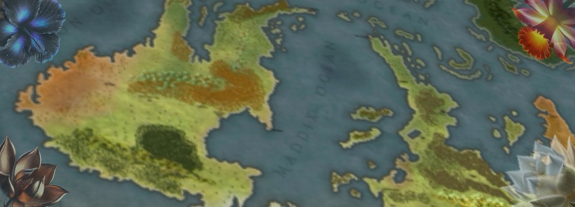

## Hey there!  I'm Jason Sturgeon, Web Developer💻 and D&D enthusiast🐲. Welcome to my GitHub. Come on in! Have a cup of coffee and make yourself comfortable.
<h3>Need my help?  No problem! Here's some of the stuff I can do.</h3>
<ul>
  <li>Build web apps using Ruby on Rails or Django + Python</li>
  <li>Set up landing pages/information pages for your business</li>
  <li>Incorporate ChatGPT into your site</li>
  <li>Build E-commerce sites on Shopify, or completely from scratch!</li>
  <li>Run the most amazing D&D campaign of all time</li>
</ul>

<!--
**Akakemushi/akakemushi** is a ✨ _special_ ✨ repository because its `README.md` (this file) appears on your GitHub profile.

Here are some ideas to get you started:

- 🔭 I’m currently working on ...
- 🌱 I’m currently learning ...
- 👯 I’m looking to collaborate on ...
- 🤔 I’m looking for help with ...
- 💬 Ask me about ...
- 📫 How to reach me: ...
- 😄 Pronouns: ...
- ⚡ Fun fact: ...
-->
